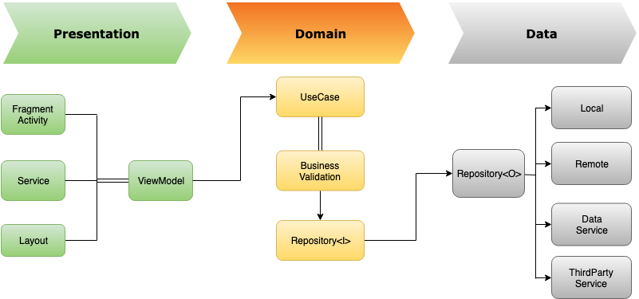
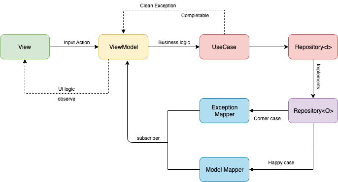

# Architecture

This is a basic code that uses Clean Architecture & MVVM & Components

-   A single-activity architecture, using the [Navigation component](https://developer.android.com/guide/navigation/navigation-getting-started) to manage fragment operations.
-   [Android architecture components](https://developer.android.com/topic/libraries/architecture/), part of Android Jetpack for give to project a robust design, testable and maintainable.
-   Pattern [Model-View-ViewModel](https://en.wikipedia.org/wiki/Model%E2%80%93view%E2%80%93viewmodel) (MVVM) facilitating a separation of development of the graphical user interface.
-   [S.O.L.I.D](https://en.wikipedia.org/wiki/SOLID) design principles intended to make software designs more understandable, flexible and maintainable.

# Modules

Modules are collection of source files and build settings that allow you to divide a project into discrete units of functionality

-   `:app` depends on `:internal:core`, `:internal:data` and `:internal:domain`.
-   `:internal:data` modules depends on `:internal:domain`.
-   `:internal:core` only depends for possible utils on `:libraries`.
-   `:libraries` don’t have any dependency.
 
 
 

# Implementation

### Data-Flow

### Work-Flow

#### Domain Layer
- Contains business model 
- Contains business RULEs
- Repository interface adapt 

#### Data Layer
- Implementation Repository
- Executor API data
- Storage data to local: Share preferences, database, external storage 
- Mapper data model to domain model
- Contains data service, third party data service  

#### Presentation Layer
- View (Activity/Fragment/Layout) Adapt data to view 
- Validate/Submit data input from view via UseCase

# Building

- Work from Android Studio `Electric Eel | 2022.1.1` and above
- Java SDK `17`
- Kotlin `1.8.21`
- Gradle `7.4.2`

For `release` builds, we need to provide release keystore and signing properties:

- Put the `{xxx}.keystore` file at root `config` folder.
- Put keystore signing properties in `signing.properties`

# Dependencies

-   [Jetpack](https://developer.android.com/jetpack):
    -   [Android KTX](https://developer.android.com/kotlin/ktx.html) - provide concise, idiomatic Kotlin to Jetpack and Android platform APIs.
    -   [AndroidX](https://developer.android.com/jetpack/androidx) - major improvement to the original Android [Support Library](https://developer.android.com/topic/libraries/support-library/index), which is no longer maintained.
    -   [WorkManager](https://developer.android.com/topic/libraries/architecture/workmanager/) - Manage your Android background jobs.
    -   [Lifecycle](https://developer.android.com/topic/libraries/architecture/lifecycle) - perform actions in response to a change in the lifecycle status of another component, such as activities and fragments.
    -   [LiveData](https://developer.android.com/topic/libraries/architecture/livedata) - lifecycle-aware, meaning it respects the lifecycle of other app components, such as activities, fragments, or services.
    -   [Navigation](https://developer.android.com/guide/navigation/) - helps you implement navigation, from simple button clicks to more complex patterns, such as app bars and the navigation drawer.
    -   [Paging](https://developer.android.com/topic/libraries/architecture/paging/) - helps you load and display small chunks of data at a time. Loading partial data on demand reduces usage of network bandwidth and system resources.
    -   [Room](https://developer.android.com/topic/libraries/architecture/room) - persistence library provides an abstraction layer over SQLite to allow for more robust database access while harnessing the full power of SQLite.
    -   [ViewModel](https://developer.android.com/topic/libraries/architecture/viewmodel) - designed to store and manage UI-related data in a lifecycle conscious way. The ViewModel class allows data to survive configuration changes such as screen rotations.
-   [Coroutines](https://kotlinlang.org/docs/reference/coroutines-overview.html) - managing background threads with simplified code and reducing needs for callbacks.
-   [Hilt](https://dagger.dev/hilt/) - dependency injector for replacement all FactoryFactory classes.
-   [Retrofit](https://square.github.io/retrofit/) - type-safe HTTP client.
-   [Coil](https://github.com/coil-kt/coil) - image loading library for Android backed by Kotlin Coroutines.
-   [Moshi](https://github.com/square/moshi) - makes it easy to parse JSON into Kotlin objects.
-   [Timber](https://github.com/JakeWharton/timber) - a logger with a small, extensible API which provides utility on top of Android's normal Log class.
-   [Stetho](http://facebook.github.io/stetho/) - debug bridge for applications via Chrome Developer Tools.
-   and more...

### Test dependencies

-   [Espresso](https://developer.android.com/training/testing/espresso) - to write concise, beautiful, and reliable Android UI tests
-   [Robolectric](https://github.com/robolectric/robolectric) - industry-standard unit testing framework for Android.
-   [JUnit](https://github.com/junit-team/junit4) - a simple framework to write repeatable tests. It is an instance of the xUnit architecture for unit testing frameworks.
-   [Mockk](https://github.com/mockk/mockk) - provides DSL to mock behavior. Built from zero to fit Kotlin language.
-   [AndroidX](https://github.com/android/android-test) - the androidx test library provides an extensive framework for testing Android apps.
-   and more...

### Plugins

-   [Ktlint](https://github.com/pinterest/ktlint) - an anti-bikeshedding Kotlin linter with built-in formatter.
-   [Detekt](https://github.com/arturbosch/detekt) - a static code analysis tool for the Kotlin programming language.
-   [SafeArgs](https://developer.android.com/guide/navigation/navigation-pass-data#Safe-args) - generates simple object and builder classes for type-safe navigation and access to any associated arguments.
-   and more...
